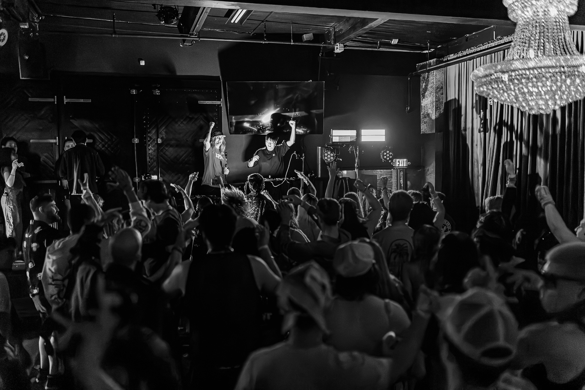

website Link： https://y4ncymusic.github.io/y4ncy.github.io/#

Final Project Reflection / AI Usage Documentation
For this final project, I made a simple but functional DJ artist website for myself. The website includes links to my SoundCloud, Instagram, YouTube, and Resident Advisor. It also contains an artist bio, a music section showing my releases, and a booking email section for potential promoters or collaborators.
Because this was my first time coding a website, I had many ideas in my mind, but I did not know how to organize them into actual HTML and CSS. I used ChatGPT as a step-by-step assistant to help me build the website, understand the code, and troubleshoot problems during the process.

Stage 1: Basic Visual Design
At the beginning, I wanted to place a large image on the homepage as the main visual background. However, after I added the image, I noticed that there was a white edge around the website, and the image did not fully cover the screen.
I asked ChatGPT why this happened, and I learned that browsers automatically add default margin around the <body> element. This default margin created the white border around my image.
To fix this problem, I added CSS to remove the default margin and control the basic visual style of the website.

The most important line here is:
margin: 0;
This removes the browser’s default spacing around the page, so the image can touch the edges of the screen.
I also used:
background: black;
color: white;
to create a dark visual style that fits my identity as a Hard Dance / rave artist.
For the image itself, I used:

The width:100% makes the image fill the full width of the browser, and height:100vh makes it fill the full height of the screen. The object-fit:cover makes sure the image covers the entire area without being stretched in a strange way.

Stage 2: Links Bar and Logo Positioning
After I finished the basic homepage visual, I wanted to add a navigation bar at the top of the website. My goal was to show links to my SoundCloud, Instagram, YouTube, and Resident Advisor, so visitors could easily find my artist profiles.
I did not know how to create clickable text links that open another website, so I asked ChatGPT for help. ChatGPT showed me how to use the <a> tag.
For example:
<a href="https://on.soundcloud.com/j8oDwptQL9aN7CN92X"
   target="_blank"
   style="color:white; text-decoration:none;">
   SoundCloud
</a>
I learned that href is the destination link, and target="_blank" makes the link open in a new browser tab.
Then I created a fixed navigation bar:

I used position:fixed because I wanted the link bar to always stay at the top of the page, even when the user scrolls down. I also used background:rgba(0,0,0,0.6) to create a semi-transparent black background, so the navigation bar can still be readable but not completely block the image behind it.
The display:flex, justify-content:center, and gap:30px helped me place all the links in one horizontal row with equal spacing.

⸻

Stage 2.5: Font and Position Adjustment
After adding the navigation bar, I felt the default font looked too simple and did not match my artist identity. I wanted the main “Y4NCY” logo text to feel more futuristic and electronic, so I downloaded a font and uploaded it into my project folder.
Then I used @font-face in CSS to load the custom font:
@font-face {
  font-family: 'Orbitron';
  src: url('Orbitron-VariableFont_wght.ttf');
}
After that, I applied the new font to my main title:
<h1 style="
  position:absolute;
  top:50%;
  left:50%;
  transform:translate(-50%, -50%);
  text-align:center;
  font-size:72px;
  letter-spacing:10px;
  width:100%;
  font-family:'Orbitron', sans-serif;
">
  Y4NCY

   

  
    HARD DANCE ARTIST / DJ / PRODUCER
  
</h1>
I used position:absolute, top:50%, left:50%, and transform:translate(-50%, -50%) to place the main text exactly in the center of the image.
The subtitle “HARD DANCE ARTIST / DJ / PRODUCER” was added inside a  tag. I made it smaller than the main logo and gave it more letter spacing to make it feel like an artist website header.
This stage helped me understand how HTML controls structure, while CSS controls visual design and positioning.

⸻

Stage 3: Animated Cover Art Link Effect
After finishing the homepage and navigation bar, I wanted to add a music section to show my latest release. I wanted visitors to click the cover art and jump to the listening page.
I asked ChatGPT how to make an image clickable and add a simple animation effect. ChatGPT gave me an example using an <a> tag around an  tag.

  <h2>Latest Release</h2>

  

  <h3>Song Title</h3>
  
Click the cover to listen

From this, I learned that I could make an image clickable by placing the image inside the <a> tag. I also learned that transition:0.3s makes the visual change smoother, and the onmouseover / onmouseout effects can create a simple hover animation.
When the user moves the mouse over the cover image, the opacity becomes lower, so it feels interactive. When the mouse leaves the image, it returns to normal.

⸻

Stage 4: Troubleshooting the Music Section Layout
After I added more music releases, I ran into another problem. I had three songs in the music section, but they appeared vertically instead of horizontally. Also, the cover images had different sizes, which made the website look messy and inconsistent.
At first, I did not know whether this was caused by the image files or by the HTML structure. I asked ChatGPT how to fix it. ChatGPT explained that by default, block elements such as 
 naturally stack vertically. If I wanted the three songs to appear side by side, I needed to create a layout container using CSS Flexbox.
To solve this, I created a music container:

The display:flex makes the song cards line up horizontally. The justify-content:center keeps them centered on the page. The gap:30px creates space between each song. I also used flex-wrap:wrap so that if the browser window is too small, the song cards can automatically move to the next line instead of being squeezed too much.
Then I fixed the inconsistent cover sizes by setting the same width and height for every image:

The most important part here is:
width:250px;
height:250px;
object-fit:cover;
Before this fix, each cover image kept its original size and ratio, so some looked larger and some looked smaller. By setting the same width and height, all covers became consistent. The object-fit:cover made sure the image filled the square area without being stretched.
After this troubleshooting process, the music section looked much cleaner and more professional. The three releases were displayed as a consistent grid, and the user could click each cover to open the related music link.
A cleaner version of the music section looked like this:

  <h2>Music</h2>

  

    

      
      <h3>Song Title 1</h3>
      
Click the cover to listen

    

    

      
      <h3>Song Title 2</h3>
      
Click the cover to listen

    

    

      
      <h3>Song Title 3</h3>
      
Click the cover to listen

    

  

⸻

Conclusion
Overall, this project helped me understand the basic relationship between HTML and CSS. HTML gave the website its structure, such as images, links, sections, and text. CSS controlled the visual style, including layout, spacing, colors, fonts, and animations.
Using ChatGPT was really helpful tool of a learning and troubleshooting . Whenever I had a specific problem, such as the white edge around the image, the fixed navigation bar, the clickable cover art, or the inconsistent music layout, I asked ChatGPT for an explanation and example code.
Through this process, I learned how to identify problems, test solutions, and gradually build a complete website with the help from AI. The final result is a simple artist website that represents my DJ identity, provides links to my platforms, shows my music, and gives people a direct way to contact me for booking.
# y4ncy.github.io
